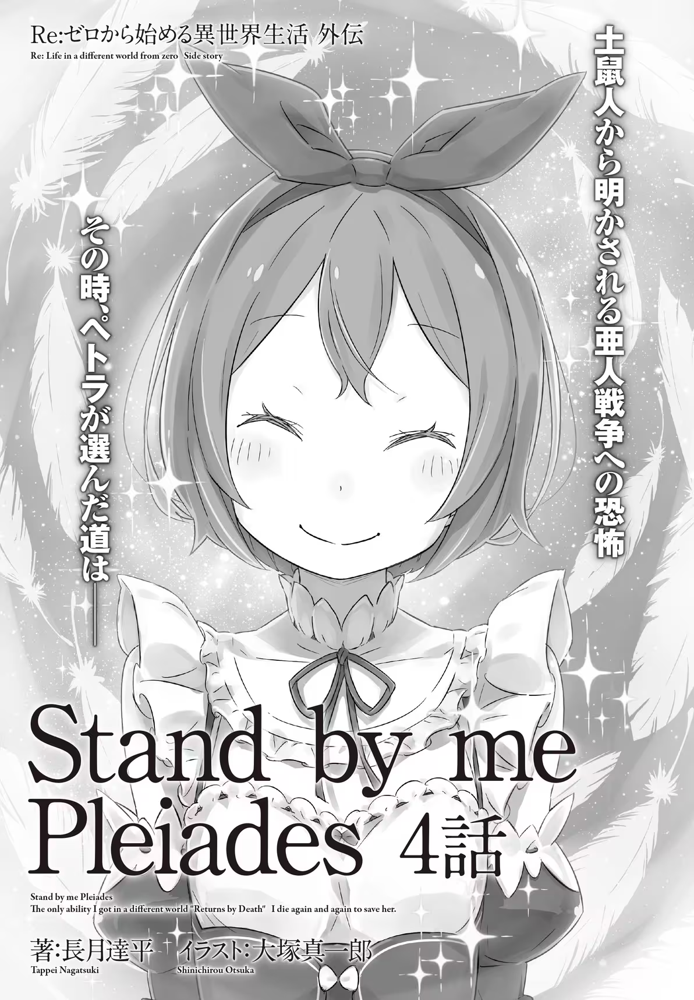
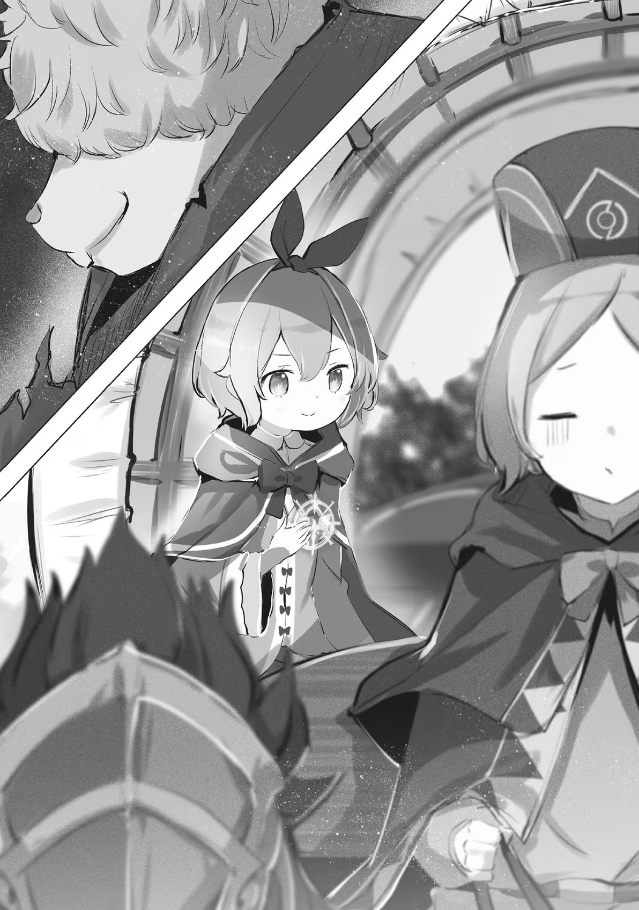

Stand by me Pleiades Part 4

Translation: Tom1111335

Proofreading: Tom111335，Garcer

Polishing: Tom11111335

Source: Ice

This is a Comic Alive short story, published on September 27, 2022,
which focuses on a confrontation between the Emilia camp and the
Mole-people. The plot reversal is a great one (if you ignore the late
anticlimactic twist).

Before reading this article, it is recommended to read the previous
short stories in this series to understand the background. The story of
this series takes place after the 25th volume of the main story (Subaru
was transported to the Vollachian Empire, and this series tells the
story of Emilia’s camp going there to find him), the previous short
stories can be found in the table of contents of this collection.

**This article is for learning and communication purposes only,
commercial use is prohibited Reprinting must be authorized by the
translator and indicate the source.**

1

――The large empty cave known as the Eternal Darkness was an irregular
method for entering the Vollachian empire from the Kingdom of Lugunica.

It was a tall cave dug by the Mole-people who were hunted by the
Vollachian Empire in the past, and it was now being used by Petra and
her camp to find the whereabouts of Subaru and the others who were flung
into the Empire.

In order to avert the attention of others, they forged identities to
sneak into the country.

Of course, they did not expect this to be a comfortable journey, but――

Petra: \[…I did not expect it to be this inconvenient.\]

???: \[Still being able to say that in this kind of situation, you
really are a very courageous lady.\]

Petra spoke without thinking, and hearing that the Mole-person―― Musica,
silently whispered and laughed. His dull laugh annoyed Petra.

The dragon carriage had been caught in a trap, and lay overturned on the
ground. Fortunately, Petra had not hit her head and did not feel any
pain.

This was all thanks to Emilia, who was hugging her tightly at her side.

Emilia: \[How is our little one… Patrasche-chan doing?\]

Musica: \[――? Ah, you're talking about the beautiful ground dragon. She
received a fright, but I've made the ground very soft. It's a bit dirty,
but it won't hurt her.\]

As if confirming Musica's answer, a cry from Patrasche came out from
outside of the dragon carriage.

Although she had no way to talk to the ground dragon like Otto, Petra
did not feel a sense of urgency from the tone of the sound. The
intelligent ground dragon would not try to cover up her injuries, this
much could be trusted.

In the long run, hiding her injuries would only make it harder to bring
Subaru and the others back.

Emilia: \[It's great that Patrasche is okay… but.\]

Although there was an attempt to find something positive, it seemed like
this was the only thing to be happy about.

It seemed that falling into the depths of the Eternal Darkness was the
strategy of Musica and the others, who were supposed to be their guides.
And sure enough, they were separated from the other dragon carriage that
was trailing behind. Since this cave was the dwelling of the Mole-people
tribe, they held the terrain advantage.

And the most important question was――

???: \[――I think I heard you say "negotiation with the Kingdom?"\]

A quiet voice that tried to suppress its emotions echoed in the
darkness, and Petra turned her gaze to its direction.

Inside that same dragon carriage, kneeling by its tilted side, was a
blurred, peach-colored, slender figure―― Roswaal.

Petra had practiced feeling the surrounding mana in the dark before. Due
to the lingering effects of her practice, the human figure she saw
appeared as a peach-colored light in the darkness.

In the compartment of the dragon carriage, besides Petra there were
Emilia, Roswaal, and one other person―― the girl who was still asleep in
the arms of the kneeling Roswaal. She was properly protected in that
fall, which gave Petra some relief.

Of course, Beatrice would be wearing a stern expression if she were
awake.

Anyway――

Roswaal: \[Maybe we heard it wrong. Aaalso~…\]

Musica: \[You didn't mishear. We've taken the young mistresses as
hostages. Are you from a noble family? If so, the Kingdom should listen
to us.\]

Petra: \[Oh, you're going to report us to the Kingdom?\]

Musica: \[Yes, that's right… Ah, are you worried that your sneaky entry
will be leaked? Well, we can only let them think you were just unlucky.
At this very moment, some nobles just happened to pass by our residence.
It's a sort of destiny, don’t you think?\]

Petra's wavering voice caused Musica to misunderstand her intention.

However, that did not mean his observation skills were poor. Petra and
the others had disguised their identities in front of him. Musica did
not know their true identities.

But, even if Musica and the others' perceptions of them were not in
accordance with the facts, it was also true that it was a very
unfavorable situation for Petra and them―― and furthermore, for the
Emilia camp.

Petra: \[…Sister Emilia-sama's stowaway entry will be discovered.\]

This fact would be very inconvenient for the Empire to discover, and
even more inconvenient if it were the Kingdom.

It was undeniable that if candidates of the Royal Selection were to
engage in illegal activities and were exposed, it would have a serious
negative impact on the Royal Selection. It was also true that being
exposed in the Empire would cause a war, but if they were to be exposed
in the Kingdom, they would definitely not be able to leave the country.

That was the situation that Petra and the others had to avoid at all
costs.

Emilia: \[This is smuggling into a country, after all. Even if someone
reports this matter, we have no right to be angry… but if that were to
happen it would reaaally trouble us.\]

Musica: \[I have no malice towards you Misses. So, my heart aches for
your sister too. But even so, I hope you will listen to us.\]

Emilia: \[It has to be like this?\]

Musica: \[Yes. Again, it would not be wise to antagonize us here.\]

Emilia supported Petra's shoulders, her beauty undiminished in the
darkness, and spoke authoritatively. However, Musica's answer made the
cold air of the Eternal Darkness even colder.

The coldness in the air was not a metaphor, it was truly becoming
colder. This was proof of the moment approaching when Emilia would make
an unexpected, impulsive decision.

Even Roswaal, who was seated with her, had no intention of dissuading
Emilia.

Earlier, Petra had thought that the terrain of the Eternal Darkness
would be an advantage for Musica and the others.

But on the other hand, she also believed. ——The terrain advantage could
not cover the gap in strength.

Even assuming that Petra was fully prepared for the challenge, she was
no match for Roswaal's magic.

In the same vein, Musica and the others had picked a fight with
opponents they shouldn't have.

Petra: \[――――\]

At the top of the trap, the separated dragon carriage at the back should
also be surrounded by Mole-people. However, the top of the dragon
carriage still had Garfiel left on it.

Of course, Petra felt that Frederica, Ram, and the witty Otto all also
had extraordinary talents as well, so there was no need to worry about
the situation of that dragon carriage.

At the outset, they were surprised and confused by the sudden trap.

Petra: \[As pitiful as it is for Musica and the others…\]

――The bottom line, however, was that Petra and the others absolutely
must reach the Empire.

Therefore, this sneaky entry must not be detected by the Kingdom or the
Empire. So, no matter what Musica and the others had in mind, their
plans could only be thwarted.

Emilia: \[Dudley.\]

Emilia's slender lips called out the pseudonym used by Roswaal, who was
still holding Beatrice.

Facing the intent carried by this signal, Roswaal's lack of a response
was itself an approval. Waiting a few seconds longer, the strength of
the two would change the whole situation.

Musica: \[Wait a moment.\]

However, Musica immediately sensed the dangerous shift in the air.

He was in the shadows pinning down Emilia and the others who were
building up their fighting spirit.

Musica: \[We can destroy this Eternal Darkness. We can survive it, but
you can't. If you understand, young miss, then please stop those two
with you…\]

Petra: \[I trust those two… I trust Emily.\]

Musica: \[You gave a very dignified answer… but we've already started
taking action. Backing out now is impossible.\]

Confronted with Petra, who refused the request, Musica grit his teeth
and summoned his strength to express his resolve. The exchange itself
represented an acknowledgment by both parties that there was no room for
negotiation.

However, the root of Musica's resolve piqued Petra's interest.

Musica and the others' actions had greatly shaken the goals of Petra and
co. However, negotiating with the kingdom using nobles as hostages could
no longer be simply described as a desparate measure for them.

What exactly were they hoping to achieve through these negotiations?

Petra: \[What is it that you want to discuss with the kingdom, using us
as hostages?\]

Musica: \[What reason do I have to explain it to you lot…\]

Petra: \[Emily.\]

Emilia: \[Ehh!\]

Musica: \[Wait a moment, wait a moment! You really are a dangerous lady,
honestly…\]

Petra nearly let go of Emilia's reins, and the frantic Musica let out a
sigh of resignation. Then, he silently yielded to Petra's unspoken
pressure, urging him to continue.

Musica: \[The selection battle for royal throne, I'm sure you Misses
have heard of it, haven't you?\]

Emilia: \[――Ehn\]

The words that were released with a sigh made Emilia, who was beside
Petra, hold her breath. Of course, Petra was also surprised.
Unexpectedly, the topic of the Royal Selection had come out at a time
like this.

It was almost as if the topic was deliberately targeting them. But from
the looks of Musica and the others, it was hard to believe that they had
noticed Emilia and Roswaal's true identities――

Roswaal: \[If they've noticed…\]

Roswaal lowered his voice and muttered in a tone that lacked any hint of
mischief.

Although Musica was unexpectedly walking a dangerous tightrope, he did
not notice that the scale of danger were tipping in Roswaal's favor and
continued.

Musica: \[This is the major event shaking up the country. Do you have a
preferred candidate, Miss?\]

Petra: \[Hmm, I'm not quite sure. I'm still evaluating it.\]

Musica: \[That's a very cautious and wise answer, in a good sense. Of
course, we're also keeping our eye on the Royal Selection―― but in a bad
sense.\]

Petra: \[In a bad… sense?\]

Petra tilted her head, while Musica nodded slightly with a "Yes".

Emilia: \[Don't make it too complicated. We won't know what you're
trying to say. …You have some thoughts about the Royal Selection, don't
you?\]

Emilia grew impatient with Musica's anser, and leaned forward, pressing
him further. Her question made Musica pause for a moment, and then he
continued.

That was――

Musica: \[What we want to negotiate with the Kingdom is the withdrawal
of a candidate of the Royal Selection―― The half-elf candidate called
Emilia. Therefore, I hope that you ladies will become our hostages.\]

This was a confession of an intention that was truly detrimental to the
Emilia camp.

2

Emilia: \[Emilia's… withdrawal.\]

Hearing that soft murmur, Petra was assailed by intense regret.

She should not have listened to Musica out of sheer curiosity. She
should have shut down the opponent's malicious plans without hesitation,
as the ruthless Roswaal had intended to do.

Because she had not done that, Emilia ended up getting hurt
unintentionally.

Petra: \[――. What do you mean?\]

Feeling regret, Petra decided to draw out Musica's true intentions.

Digging for more details had the potential for his comments to further
harm Emilia. However, the spear had already penetrated Emilia's chest.
So she had to find out whether the spear was coated with poison, and how
much force had been put into it.

If you did not know how deep the wound was, you would not know how to
treat it.

Petra: \[As you said, the Royal Selection is very important to the
Kingdom. However, its rules do not change easily. Even if we became
hostages…\]

Musica: \[Miss, your lives cannot shake the country. Is that what you
mean to say?\]

Petra: \[…Yes.\]

Petra appealed to her inner self, taking as much care as she could to
keep her answers calm.

Her argument made sense. Not only Petra's answer, but Musica's as well.
His answer had no impurities, nor he did not unreasonably force Petra to
shut up.

They did not yield to Emilia's imposing manner, and had already readied
their resolve.

That was why, this move was so questionable.

Petra: \[In terms position, I think we're on the affluent side. But if
you look at it as a whole, I think the central administration of the
kingdom would have a different opinion.\]

Musica: \[This kind of behavior is meaningless. So, do you Misses want
to persuade us?\]

Petra: \[If you can be persuaded.\]

Hearing Petra's answer, Musica let out a weak, bitter laugh.

Through his reactions and dialogue, Petra felt that Musica was not a
short-sighted person. But if that were the case, it was even more
incomprehensible for him to enact such a ridiculous plan.

At least on the surface of the intelligence they had gathered, their
existence themselves could not be the decisive factor in making Emilia
abandon her participation in the Royal Selection.

In fact, that it was not a decisive factor just made the story
complicated.

Roswaal: \[Lady Petra, even having this dialogue with them…\]

Petra: \[Dudley, enough.\]

In the darkness, Petra cut off Roswaal's attempt to interrupt.

She shook her head, and gestured to the Emilia next to her with her
chin. From that gesture alone, Roswaal would be able to correctly
decipher Petra's intentions.

Emilia: \[――――\]

How must Emilia be feeling right now, her body tense and silent?

Her heart, already about to collapse under the weight of worry for
Subaru and the others, suddenly had an unexpected burden placed on it,
and even Emilia could not bear it.

It was for that reason, that this heavy burden must be removed.

For that purpose――

Petra: \[Methods meant for emergencies should not be used in
non-emergency situations.\]

There were always ways to ruin this situation. But if it were Subaru,
who was not here, he would have thought it through to the very end,
sacrificing something to reach out with a helping hand.

Although Petra had learned a lot and felt a sense of growth, she hoped
that Subaru’s philosophy would firmly take root at the center of her
development. She wanted to live out his beliefs.

So, she did not want to rely on Roswaal's ruthlessness here.

Petra: \[Please tell me. Musica-san, your thoughts, demands, and
purpose. Because we need some material to convince you.\]

Musica: \[That's a more than bold request… Let me make it clear, we’re
up against the country, not you Misses. I have no particular reason to
provide you with persuasive material.\]

Petra: \[If it is a demand that cannot convince even a little girl like
me, then the country will not pay any notice to it.\]

Musica: \[――. If this is to delay time, this is meaningless."

Petra: \[That was not my intention.\]

Petra calmly lied, feeling the gaze of the people outside the dragon
carriage.

In fact, it would not be wrong to say that she was buying time. However,
the time Petra was spending now was not for herself, but for Musica and
the others.

The moment this conversation is cut short and the discussion could no
longer continue, Roswaal would mercilessly attack Musica and the others.

Perhaps, this would allow Petra, Emilia, and the others to get out of
this predicament safely.

But, going this way would not pull out the thorn that had pierced
Emilia's heart.

Petra: \[That is absolutely not okay.\]

Perhaps time would heal the stinging and the pain. But, the Empire that
Petra and the others were about to enter was filled with dangers and
unknowns waiting for them.

Bringing a heartbroken Emilia to that kind of place was unsettling, and
above all, Petra was unwilling to do it.

That would leave Emilia with a constant taste of pain and suffering.

Petra: \[Why do you want Emilia-sama to give up the Royal Selection? Is
it because Emilia is a half-elf?\]

Musica: \[Is there any other reason? That reason alone is enough to want
her to withdraw.\]

She had asked the question not expecting a serious answer, but this
sudden response indicating that she was correct made Petra purse her
lips. [^1]

[^1]: I'm still not entirely confident in this translation. Supposedly, 挨拶代わりの質問 means "The question substituted for a proper greeting", and the Chinese 质问代替了回答 means "The question replaced the answer", and neither really makes much sense to me in this situation. I'm guessing the Japanese is saying that Petra used a question as a way to start the conversation instead of a greeting, but this still doesn't fully make sense as they've already been talking with Musica for a while now. Just based on the flow of the conversation, my guess to the actual meaning would be something along the lines of Petra asking the question not expecting a serious answer, but from Musica's response she realizes that she hit the mark and it upsets her.

It was a logic that sounded all too familiar. For most people that hated
Emilia, like Musica, they would list her background as a reason.

Even Petra understood perfectly well how deeply rooted the problem was.
But, every time Petra heard it she felt frustrated.

The reality is that people who knew nothing would arbitrarily lump
together the term "half-elf" with Petra's beloved "Emilia."

Petra: \[Saying it like this, I have heard enough of it.\]

Musica: \[This just proves that a lot of people have the same idea.
There's no point in a candidate becoming the country's king if so many
people turn their backs on them.\]

Petra: \[But even if it is like that――\]

No one would take drastic measures like Musica and the others.

When she was about to say this, Petra subconsciously closed her mouth.
Not because she was worried about angering them, but because she felt
that what she was about to say was something that came too naturally to
her.

Petra: \[――――\]

Most people who hated Emilia had the same views as Musica and the
others. However, these people would not going to riot to get Emilia to
withdraw from the Royal Selection.

They would just do nothing, thinking that the silver-haired half-elf had
no chance of winning.

There seemed to be many such people, which made Petra feel even more
angry―― but in that case, why would Musica and the others take such
action?

The reason is that those who do nothing were in a different position
from Musica and the others.

If you think about the root cause of this reason――

Petra: \[――Emilia-sama's participation in the Royal Selection, is it
undesirable to the people of Mole-people tribe?\]

Musica: \[――Hk!\]

Musica reacted slightly sharply in response to Petra's thoughts.

Convinced that she had guessed correctly, Petra went further with her
speculation.

Emilia's rise for Musica and the others―― The Mole-people, why was this
situation undesirable to them? As discussed on the journey earlier, the
Mole-people tribe were mentioned as one of the races expelled from the
Empire.

Based on the historical events, Iris and the King of Thorns took away
the Mole-people's place in the Empire.

Musica's ancestors fled the Empire and their descendants continued to
live in Shamrock Valley, eking out a living by helping people smuggle
into the country.

Petra: \[――Why?\]

This was not the Empire, there was no need for Musica and the others to
cower.

Of course, Iris and the King of Thorns was a very famous story, many
people in Lugunica also knew it. Even then, their treatment here should
be completely different from that in the Empire. Despite this, Musica
and his tribe continued to live here together in this dark, secluded
place.

They refused to interact with the outside world, their attitude of
staying behind closed doors, it was like――

Petra: \[――like the Sanctuary.\]

In Frederica and Garfiel's hometown, there was a settlement called the
Sanctuary, home to demi-humans with a mysterious past.

Petra only visited once, after the conflict surrounding the Sanctuary
was resolved. The once closed-off settlement has since been dismantled,
and its residents have relocated to various villages within the
territory.

Therefore, there were now only a few guardians of the forbidden cemetery
left, including Frederica and her grandmother, Ryuzu.

The way of life in the Sanctuary, and the way the Mole-people lived in
Shamrock Valley, seemed to be the same in that both were lives spent in
a world that rejected the outside.

If that was the case, then the reason they chose that lifestyle might
also be the same.

Petra: \[Could it be that, the reason Musica and the others want Emilia
to give up the Royal Selection has something to do with the Demi-human
War?\]

Musica: \[…Miss, can you read people's minds?\]

Petra: \[I cannot. I do sometimes wish I could read them.\]

Sometimes, Ram and Otto and the others said and did things that made you
think they could read others's minds. Still, putting aside Otto, who
makes tactless remarks, she wanted to learn from Ram's keen foresight.

That was because her goal was to absorb all the strengths of everyone
within the camp and become a better version of her self tomorrow than
she was today.

In any case, Musica's reaction proved the correctness of Petra's
reasoning.

Petra: \[…Demi-human War\]

――That was the large-scale civil war that broke out in the Kingdom of
Lugunica decades ago.

This civil war, a fierce clash between humans and demi-humans, lasted
for nearly ten years, resulting in an enormous number of casualties.
Although the trigger seemed to be something minor, it was heavily
influenced by the longstanding resentment between humans and
demi-humans.

And the origin of this resentment was――

Musica: \[――The Witch of Envy, and the animosity towards demi-humans,
including half-elves.\]

At the end of Petra's train of thought, it was none other than Musica
who brought it to a close.

When the term "Witch of Envy" was mentioned, Emilia's expression grew
even darker. And Petra also came to realize that Musica's actions were
very much those of someone personally involved.

As he said, the reason for the Demi-human War was humanity's animosity
towards demi-human―― In the kingdom that had been severely affected by
the calamity of the Witch of Envy, the persecution of half-elves was
particularly thorough. Eventually, that animosity spread to other
demi-human races beyond the half-elves, sparking a civil war that blazed
into a great firestorm.

And that dreadful civil war, which wounded so many, caused untold
suffering, and claimed countless lives――

Musica: \[The world has spent four hundred years carefully healing those
old wounds. But the half-elf stirred things up by challenging a battle
they had no hope of winning, and once again, blood has been spilled;
it's just too much.\]

――Musica was afraid of that happening again.

3

???: \[――――\]

Musica's low voice sounded as if it had been worn down by the combined
weight of fear and fatigue.

Petra could not quite process the complex emotions contained in that
voice. This was to be expected, given Petra's short life experience; she
could not grasp the emotions carried by Musica, who was the same age as
her father.

Moreover, this sentiment was not limited to Musica, but it carried the
weight of four hundred years.

Musica: \[We don't want to be dragged into this. If we're talking about
being dragged into something, we've already had more than enough of
it.\]

Petra: \[Being dragged into this…\]

Musica: \[Yes, these are the consequences of the mistakes made by my
grandfather's grandfather's generation. If you're a studious young lady,
you should know it very well.\]

Petra: \[――――\]

Musica: \[If it was something my parents and brothers did, I would give
it up. But we don't even what know what the faces of our grandfather's
grandfather's generation looked like. Do we really have to live like
this, in a hole in the ground, because of those people’s
responsibility?\]

Petra was at a loss for words in response to Musica's explanation.

Petra herself had enjoyed the book Iris and the King of Thorns,
including its tragic ending. However, it was not as pleasant for the
parties who were still begin discussed hundreds of years later.

Musica was right, Petra knew nothing about her grandfather's
grandfather's generation or her earlier ancestors. But that
responsibility still weighed on them today.

Petra: \[But, that would be the same for the half-elves. There's no one
that's like the Witch of Envy, and yet…\]

Musica: \[You want to interfere with someone who is putting in their
all? …I told you before. I don't want to get caught up in it anymore.\]

As if to quiet Petra, whose voice was trembling, Musica's tone lost its
emotion. Calmly, he presented Petra with the irrefutable facts.

Musica: \[Having said that, we've accepted our situation. Just as there
are people born rich and poor, there are Mole-people and other races. It
is our destiny to live in the darkness and remain in the shadows.\]

Petra: \[This way of saying it…\]

Musica: \[For the kind Miss, this reality might be painful. But even
those of us who have come to terms with the situation don't want it to
get any worse than it already is.\]

Emilia: \[Worse, than it already is…\]

Hearing Musica's narration, Emilia could not help but speak up.

As if hearing her whisper, Musica seemed to remember that there were
others present with Petra, and changed the tone of his voice.

It shifted from an indifferent and dry tone to a cooler, more controlled
one, with a touch of warmth aimed at making it easier to listen to.

Musica: \[The half-elf's participation in the Royal Selection, I have no
idea what she or her supporters are doing, but from our perspective, all
we can say is that it's just an obnoxious display.\]

Roswaal: \[I also agree that I don't know what her supporters are
thinking…\]

Petra's gaze happened to glace at the culprit, Roswaal. Of course,
Roswaal did give a response, and Petra was not expecting one.

But no matter what Roswaal's intentions were, Emilia's intentions should
be well known.

Roswaal: \[Emilia-sama's intentions have been clearly announced. Musica
also…\]

Musica: \[Improving the situations of those born without choices and
placed in difficult circumstances… Yes, we've heard about that as well.
――but that's just unnecessary meddling in other people's business.\]

Emilia: \[――Meddling in other people's business.\]

Musica: \[Yes, that's right, Miss Guard.\]

Unable to bear the casually cruel remark, Emilia obsessively ruminated
on those words, which drew Musica's pointed anger towards her.

Musica: \[Half-elf… and of all things, same as the 'Witch of Envy', she
bears silver hair and amethyst eyes. Who would want such a person to
become their king?\]

Petra: \[I- I don't understand. For example, I might be the someone who
wants that.\]

Musica: \[In that case, I would be happy to tell her how precarious the
situation for her supporters is.\]

Petra: \[Ehn…\]

This deliberately oppositional response revealed the impenetrability of
Musica's stubbornness.

But to the side of the suppressed Petra, Emilia loudly called out again,
"Wait a moment."

Though she was hiding her true identity, but she could not conceal the
sincerity that shone in her eyes.

Emilia: \[Please tell me more. About what you said about meddling and
being dragged into something.\]

Musica: \[――. Really, are you sure you're not trying to buy time? You're
waiting to see what those people in the dragon carriage behind will do,
aren't you?\]

Emilia: \[It's nothing like that!\]

Petra: \[――I don't have much expectation from that side.\]

Petra answered clearly in place of Emilia, whose voice was trembling
from being suspected.

This was not a lie, rather, it was a sincere statement. Petra did not
expect that Frederica and the others, who had been separated, would be
able to resolve the situation.

On the contrary, if they only needed to defeat Musica and the others,
they could do it immediately now with Emilia and Roswaal's power.

As previously analyzed, the Mole-people were no match for Frederica and
the others. Garfiel alone was enough, and there was Otto on the
battlefield as well.

This was like being drunk in a warehouse full of fire stones, it was
very dangerous behavior.

Despite this state of affairs, there were still no signs of large-scale
movement or explosions from that direction, not because they were in a
difficult situation, but because they had chosen to wait and see what
would happen.

Probably, the dragon carriage carriage on the other side was prepared to
coordinate with Petra and the others's movements.

Petra: \[So, you can tell me everything you're thinking, it's okay.\]

Musica: \[Such a brazen answer. I don't really have any basis to believe
that… it was about meddling and being dragged into things, right?\]

What he said was right, there was no credible basis for Petra's words.

Even so, Musica maintained a solemn air, showing a posture as if to
answer Emilia's question.

Musica: \[About the eyesore, do I need to explain? The half-elf has no
chance of winning the Royal Selection itself, and she'll only draw
attention to herself in a negative sense.\]

Petra: \[That is just jumping to conclusions.\]

Musica: \[The studious young lady, to be un-studious only in this one
thing, it's truly laughable. Miss, you should also know how much the
Witch of Envy is feared. Moreover, just being able to remind you of her,
that is the biggest problem.\]

Petra: \[Being able to remind…?\]

Hearing the strange phrasing, Petra could not help but tilt her head.

Although she did not want to agree with Musica’s opinion, the rumors
about the Witch of Envy were common knowledge throughout the world.. It
was impossible to forget, so there was no need to remember it.

However, in response to Petra's thoughts, Musica clicked his tongue
softly.

Musica: \[Being able to remind you of her, Miss. It's only when the
half-elf appears in public, that everyone will remember the person they
had been able to ignore and not be conscious of is actually real, that's
how they'll think.\]

Petra: \[…I do not really understand what you mean.\]

Musica: \[This is common sense to us. The Witch of Envy is a terrifying
existence, and anything related to the half-elf who created it will only
bring bad omens.\]

Petra: \[――――\]

Musica: \[However, even if it is common sense, in other words, as long
as you don't look straight at it, you can forget about it. Yes, I had
already gone through the trouble of forgetting it. …but, the Royal
Selection candidate, Emilia, was able to remind me. The fact that we
used to be afraid of that thing.\]

In the pitch black of the Eternal Darkness, Musica's cold, gloomy tone
echoed, carrying a trace of moisture.

While Petra listened to his words, she recalled, for the first time in a
while, what had happened a long time ago.

――she too was once just an ordinary village girl who feared the
existence of the Witch of Envy.

Regarding the Witch of Envy, she could not remember when she first about
her.

However, by the time she became aware, Petra already knew. The very
words "Witch of Envy", just thinking about them kept her up at night,
and she had even cried from that fear before.

It was so incomprehensible that it deeply pierced the girl's heart,
engraving a primal fear into it.

Petra: \[…I was really scared.\]

Regarding the Witch who had never been seen or talked about, Petra
feared it from the bottom of her heart. She had indeed spent sleepless
nights, thinking about the taboos that should not be touched carelessly.

That fear gradually faded, and even when the sun set behind the
mountains, she no longer remembered. The Witch, who had become distant,
when exactly did she start being pushed to the corner of her mind?

However, she had not overcome that. ――Suddenly, it would surface with
just the slightest trigger.

For example, when the half-elf Royal Selection candidate made her
appearance.

Petra: \[…Everyone in the village was awful too.\]

When the start of the Royal Selection was officially announced, and the
news spread throughout the country, Petra clearly remembered the changes
that occurred in her hometown, Arlam village.

As soon as it was revealed that the unknown girl who had been visiting
the nearby lord's mansion was the silver-haired half-elf involved in the
incident, the villagers adopted a distant attitude towards her.

Even though she had desperately tried to protect the villagers, no one
listened to her.

Emilia: \[Also, how does this connect to you getting dragged into it?\]

With the same silver bell voice she had used when the villagers rejected
her, Emilia tried her best to understand the true intentions that drove
Musica to take this action.

Emilia: \[If Emilia participates in the Royal Selection, everyone will
think about the Witch… Ahhh, I think so too. But, why does this harm you
guys?\]

Musica: \[Nothing immediate would happen. But just as a calm river flows
from upstream to downstream, the problem will flow downstream
eventually.\]

Emilia: \[――?\]

Musica: \[If the half-elf brings attention to the Witch, the same thing
as in the past may happen again. I fear that this will fall upon us.\]

There was a sense that Musica was slowly shaking his head, and he
solemnly raised the question again.

Musica: \[Supporting the weak, the ideals of the half-elf in this
situation are noble, but this is not much different than a child's empty
declaration that they will defeat the Sword Saint. If she were just a
snot-nosed kid, we could ignore her. But the problem with this nature
is…\]

Emilia: \[Because you cannot ignore Emilia, that's why it's reaaally
troubling…\]

Musica: \[Well, if you put it in a cute way, that's what it means.\]

The path to the conclusion was finally paved, and Musica nodded. Emilia
understood his argument, and her well-shaped eyebrows furrowed with
sorrow. Of course, Petra also fully understood Musica's argument and
thoughts.

But this was――

Musica: \[At least, that's what I wanted to avoid. ――The second
Demi-human War, or something like that.\]

Petra: \[That kind of situation.\]

It was just pessimism piled on pessimism, with malice fueling the
imagination. It could even be called a persecutory delusion.

However, just as Petra was about to retort, she was stopped by Musica's
cold voice, "Really?".

Musica: \[Are we really overthinking this? That long time ago, when the
Demi-human War first broke out, didn't everyone think that such a thing
would never happen.\]

Petra: \[――――\]

Musica: \[I'm not blaming you, miss. If you say that we're too
pessimistic, then that could be the case. But I suppose that's just the
nature of us Mole-people, who only know how to mess with dirt. We can
feel it, the tremors in the earth.\]

Petra: \[Tremors in the earth…\]

Musica: \[Yes. It's the omen of something big about to collapse, that
kind of tremor in the earth.\]

It was superstitious talk, yet it weighted heavily and deeply on Petra's
heart.

After fully hearing Musica's reasoning, Petra cursed her own
shallowness. ――Not only was she unable to remove the thorn that had
pierced Emilia's heart, but Petra's own heart had also been pierced.

This barbed thorn, if you try to pull it out, would only end up widening
the wound. Maybe they should have ended this conversation while the
wound was still shallow, holding on to a glimmer of hope.

Because――

Petra: \[I do not want to doubt Sister Emilia-sama…\]

Musica's logical argument could not be denied, because there was nothing
wrong with his reasoning, except for being overly pessimistic.

In the past, the animosity towards the Witch of Envy was the cause of
the civil war. Now, no one had any basis to say that this time would be
any different. What does not exist could not be proven.

――Petra understood Emilia. So, she was able to believe in Emilia.

But, for those who could not distinguish between Emilia and the
fantastical "half-elf", how could they make them believe in Emilia?

Merely hiding Emilia's identity would not be able to convince the Musica
in front of them.

Petra: \[Emily, I…\]

For a moment, Petra was so shaken that she almost called out Emilia's
name, but she managed to hold herself back.

Although she wanted to do something to ease the pain in Emilia's heart,
Petra found her own powerlessness unbearable――

Emilia: \[――Petra-chan, it's okay\]

Petra: \[Ah…\]

Suddenly, her body was pulled close, and Petra's head rested against a
warm chest.

From the voice that came from immediately above her head, she understood
that it was Emilia embracing her.

Pressed tightly against the depths of Emilia's chest, she could hear her
heart beating.

It should have been that being forced to bear this pain, doing her best
to tell her

Emilia: \[I thought about it. ――There must be a lot of people like
Musica and the others. What should I do to make those people feel
reassured?\]

Musica: \[What… what do you want to do…?\]

This was exactly the answer that Petra wanted most.

How would Emilia persuade, reason with, and convince someone like
Musica, who was tainted by the poison of a pessimistic future, to take
action?

In this way, while Petra was waiting for an answer, Emilia――

Emilia: \[I think the most important thing is to talk to them, make them
understand that I am completely different from the Witch of Envy. So I
surely… No, I think Emilia would run.\]

Musica: \[Go, run…?\]

Emilia: \[Yup, that's right. When faced with people who are different
from her, misunderstandings, or other difficulties, Emilia would run to
that person and talk to them. She would keep talking, until the other
person understood. If she won't be heard, she'll keep trying with all
her might until they do!\]

The force of Emilia's tightly clenched fist was palpable, leaving Petra
speechless.

This excessively forceful statement, it was undoubtedly a reflection of
Emilia's philosophy.

However, in this situation, was it appropriate to use Emilia's
philosophy as a solution to this problem?

Firstly, even if Petra, who knew Emilia, agreed, how could Musica
possibly be convinced?

Emilia: \[Um, is it okay if I also ask about what Musica just said?\]

Musica: \[…What is it, Miss Guard?\]

Emilia: \[I reaaally understand how you feel about not wanting to
trigger a second Demi-human War. I don't want that to happen either, if
I can stop it I definitely will. But, what you said is a bit strange!\]

Musica: \[――――\]

Emilia: \[In the past, when the Demi-human War broke out, no one thought
that such a thing would happen. But, we all know that the Demi-human War
already happened. The Demi-human War caused immense sorrow, and no one
wants to repeat it.\]

Musica's logical argument was based on past events and an assertion of
Emilia's dangerousness.

It could be said that the precedent made his concerns seem more
legitimate. In fact, Petra was deeply shaken because she was overpowered
by the force of his argument.

However, Emilia used the past precedent to her advantage―― No, Emilia
probably would not think of something that clever.

She just sincerely wanted to use past events as a way to reflect and
make the future better.

Emilia: \[If everyone disagrees, and Musica and the others know that,
then the tremors in the earth that Musica said he heard were just a
misunderstanding. This is what Emilia would think.\]

Musica: \[…I'm starting to get a strange feeling.\]

Emilia: \[Strange feeling?\]

Emilia threw her unreasonable logic at him, leaving Musica speechless.
The voice made Emilia tilt her head in confusion, and Musica exhaled
deeply,

Musica: \[It felt like we were talking to the very candidate we were
trying to get to withdraw, herself. What the Miss said about her
preferred candidate, was that all just a joke?\]

Emilia's way of speaking and Petra's reaction, those two things had left
Musica with that feeling.

Despite her efforts to hide her identity, she was in a ragged state.
Given the extent of her exposure, it would not be surprised if her
identity were discovered; Petra grit her teeth, neither confirming nor
denying.

She loved Emilia's speech just now, it was so typical of her and
completely ridiculous.

But, it was not easy to realize those desires――

Emilia: \[It's okay, I'm not the Witch of Envy, and I'm not alone.\]

Emilia's bold speech, grounded in the existence of Petra and her other
comrades, struck Petra more profoundly than Musica's pessimistic words
about the future.

At the same time, she remembering something. ――Just how did the people
of Arlam village, who had tried so hard to treat Emilia coldly, come to
accept her existence?

Talking to Emilia, understanding Emilia, and interacting with Emilia.

Since then, they knew that Emilia was not terrifying at all, but a cute
and gentle half-elf.

Not at all like the legendary Witch of Envy, a half-elf with silver hair
and amethyst eyes――

Petra: \[――Ah\]

Suddenly, Petra realized something.

Petra: \[――――\]

Petra's thoughts expanded as she recalled the conversation that had been
exchanged in the Eternal Darkness thus far.

And just like this, she arrived back at the question that had been
avoided.

In order to find the answer to that lingering question, Petra lifted her
head from Emilia's embrace and turned toward Musica's direction outside
the dragon carriage.

Then――

Petra: \[――Musica, you have never called Emilia a half-devil, have
you?\]

That was the clue she had originally sought.

4

Most of the people who disliked Emilia, such as Musica and the others,
used her background as their reason.

But, most of them called Emilia a "half-devil". Petra loathed the term,
as it made her feel an intolerable sense of isolation.

Petra: \[But, Musica and the others have not done that even once. I
remember it very clearly.\]

Despite wishing for Emilia to be disqualified from the Royal Selection
and voicing concerns about the dangers of her rise, Musica consistently
referred to Emilia as a "half-elf".

It was not because Musica did not actually dislike Emilia, which would
be too naive to believe, but rather because of his own background. ――Not
because of Emilia, but because of Musica himself.

Petra: \[Musica, you are also a Mole-person who has always been looked
at with disdain by the people around you, right?\]

Musica knew that she would be exposed to prejudice, so he might have
hesitated to disparage Emilia by calling her a "half-devil" himself.

And Petra could not help but feel that this was the key to the plan.

Petra: \[Musica, what method do you plan to use to negotiate with the
kingdom by taking us as hostages?\]

Musica: \[――. It's not a difficult topic to bring up. The Regundra
family knows that we're with the Miss and the others. We'll report
situation as it is to the Regundra family, and then report the news to
the royal capital――\]

Petra: \[But, you know this plan is not going to work, right?\]

Musica: \[――――\]

Petra: \[Even with us as hostages, the bit shots in the country will not
listen to you. Musica, you and the others should have known that from
the beginning.\]

As usual, the presence of the real Emilia would complicate things, but
if Musica saw Petra and the others as just the entourage of a young
noblewoman, their plan would not succeed.

That was if Musica and the others were really aiming to get Emilia to
withdraw.

Musica: \[…I just believed it made sense to make waves.\]

Petra: \[In the beginning, you just wanted to stir up the storm, is that
right?\]

Musica: \[Wha-… Hk!\]

Petra: \[Then, the Mole-people could be seen as those who bravely
confronted the ones who brought back the terrifying memories of the
Witch of Envy.\]

After Petra's pointed remark, Musica's voice sounded audibly shaken for
the first time. Unlike the previous feigned, guiding responses, this
time it was a shock from being directly hit by the unexpected.

Receiving such a reaction, Petra finally felt a sense of accomplishment
this time.

Petra: \[In the trap, you have been protecting Patrasche from being
harmed and have been willing to talk to me like this; despite
everything, I should have found that strange, but I did not.\]

While protecting the trapped ground dragon, he said that he would not
cooperate in buying time by having a patient conversation with the
imprisoned Petra and the others; but he still completely fell for
Petra's time-buying trick.

As the conversation progressed, the seeds of doubt were planted in
Petra's heart―― these arrangements were all made in the hope that, when
their demands ultimately failed, this contents of this conversation
would spread from the mouths of Petra and the others once they were
freed.

――If Emilia becomes the selected candidate, the second Demi-human War
might break out. To prevent this situation, the Mole-people risked
everything to be the first to speak out loudly.

However, this plan required more than just the outward appearance of its
successful execution, it required a certain level of awareness.

The reason was――

Roswaal: \[If this story reaches the central administration of the
country, the Mole-people's reputation would be tarnished. If you
threaten the country by taking the Kingdom's nobles as hostages, then
all the people of your tribe would suuurely~ be held accountable.\]

Petra: \[Guu… Hk!\]

Roswaal: \[On the contrary, that's exactly what you waaanted~, isn't it?
――When accountability is called for and the penalties are widely known,
people will seek answers. The heroic atrocities committed by the
Mole-people for the sake of the world.\]

Roswaal put Petra's inferences into words as if he were deeply
dissecting them.

Petra grimaced at Roswaal's incisive remarks.

His matter-of-a-fact way of talking made her even more angry because
Petra realized that he had come to the same conclusion earlier than she
had.

Looking back, Roswaal's speaking frequency had dropped sharply from the
early stages of the discussion. Although it was unclear when he first
became aware of Musica's intentions, once he did, he chose to remain
passive and observe.

The reason behind this could somewhat be guessed, and it was
infuriating.

Petra: \[But, I'm even more angry… It's like suicide for the
Mole-people.\]

Emilia: \[Eh…!?\]

Emilia, slightly struggling to follow the conversation, widened her eyes
at Petra's words. But, it was understandable that she could not keep up.
It was an idea that Emilia would never have.

Musica and the others were prepared to die as brave people who cared
about the future of the kingdom.

That was probably because――

Roswaal: \[Persecuted because of historical events, and rebelling
against the absurdity of fate… It could be said that you fought your own
fight to erase the prejudices directed at the Mole-people.\]

Petra: \[…I really don't want a Demi-human War to happen either.\]

Roswaal: \[Hoh, as expected of Lady Petra, you are really kind.\]

Petra stuck out her tongue at the added sarcasm, and her disgust for
Roswaal intensified.

Musica's actions were hardly commendable, and they were a real nuisance
to Petra and the others. However, it would be biased to jump to the
conclusion that all their motives and intentions were despicable.

That sort of perspective was no different from treating Emilia the same
as "half-elves."

Petra: \[Musica, what do you and your group think?\]

Musica: \[…It seems like we're cursed by a fate where nothing goes
right.\]

That voice conveyed an image of his shoulders slumping in defeat.

With no room left for excuses and their plan exposed, Musica let out a
hollow laugh. At this point, there was nothing left to do but laugh.

Musica: \[As the Miss and others have said, our intentions were exactly
on this despicable plan… it was the foolish hope of those who betrayed
Iris and incurred the wrath of the King of Thorns.\]

After a bout of laughter, Musica said this as if resigning himself.

Petra and Roswaal's speculation was correct, they were battling the
ghosts of their ancestors's actions.

Emilia: \[Look, Musica, I――\]

Petra: \[Emily, wait.\]

Emilia could not bear the sorrow in that voice, and a hint of resolve
flashed in her own.

But just as she was about to make a decision, Petra stopped her.

At this moment, Emilia planned to reveal her identity and confront
Musica head-on.

The idea itself was noble and very much in line with Emilia's style. But
if she did this, it might throw Musica’s mind into chaos and darker
thoughts.

So this was not the time for Emilia, the guard, to make her appearance,
but for Lady Petra, who was leading the group, to step forward.

Even if their entire tribe were to perish, the brave Mole-people hoped
to prevent the second Demi-human War that could be sparked by Emilia’s
existence as a half-elf.

What they should say to those who sought that honor but ultimately
failed is――

Petra: \[――Musica, rather than negotiating with the kingdom, how about
negotiating with me instead?\]

Petra on the way back, from Tanpenshuu 8, illustrated by: 福きつね

5

――The passage through the Eternal Darkness leading into the Vollachian
Empire was reopened, and the dragon carriage rocked forward.

???: \[My butt hurts…\]

On the seat of the rocking dragon carriage, Petra muttered this while
repeatedly adjusting the position of her butt.

Hearing Petra's words, the presence sitting next to her said gently――

???: \[This is the consequence of your recklessness, just accept the
pain and groan quietly.\]

Petra: \[…Ram nee-sama really is not gentle.\]

Ram: \[I wasn't gentle in the first place. Besides, to begin with I'm
not even a nee-sama. Right, Lady Petra?\]

Under those pale red eyes devoid of mercy, Petra slumped her shoulders
and groaned, "Ugh…". And in the midst of such a conversation between
Petra and Ram.

???: \[Ram, please don't bully Lady Petra.\]

Petra: \[Huu, Frederica nee-sama…\]

Frederica: \[Not nee-sama, Lady Petra. And while I did advise Ram, I'm
still very angry, you know. Yes, I'm absolutely fuming.\]

Sitting across from her was Frederica, her arms crossed and her emerald
eyes narrowed, leaving Petra speechless.

Suddenly, a cheerful laugh rang out from the roof of the carriage,
"Kuhahahaha!".

???: \[There's nothin' we can do about it now, Lady Petra. I can
understand the feelin' that Sis and Ram are tryin' to express. But it
feels good to surprise that bastard Roswaal.\]

Frederica: \[Garf, please don't speak so flippantly! Lady Petra, if
there is any change in your condition, please inform me immediately.\]

Petra: \[I, I know. I'm sorry for making you worry, Frederica ne…
Frederica.\]

Petra lowered her head as she spoke, and Frederica's brows furrowed with
an "Honestly." Her expression carried not only a strong sense of
reproach but also even more concern.

Since being placed into the dragon carriage of the group that rejoined
them, Petra had been constantly apologizing.

But that was also to be expected.

???: \[I didn’t expect Lady Petra to negotiate for the other party’s
approval… putting Emily aside for now, what is Dudley doing?"

Petra: \[He was grinning, perversely watching to see if I'd fail.\]

Otto: \[It seems not too far from the truth, but there's a bias in the
crucial part where it might have gone off course…!\]

Otto, holding the reins at the driver's seat, responded to Petra's
answer like this.

However, in that darkness, he touched his hat, "Oh dear."

Otto: \[So, Lady Petra, are you really okay? ――What about the effects of
the oath?\]

Petra: \[…It's fine. Really.\]

It might seem insincere to say, but it was the truth.

In fact, there was nothing wrong with her physical condition. Mentally,
it might have felt a bit premature, but the sense of accomplishment was
even stronger.

Finally, there was the sense of accomplishment in being a member of
Emilia's camp and becoming a part of her strength.

Otto: \[It's dangerous to get caught up in that feeling, you better be
careful.\]

Ram: \[As for Otto, it's already too late.\]

Otto: \[It's because I'm somewhat aware of it that I don't want you
bringing it up!\]

Listening to Otto's high-pitched voice crack, Petra looked down at her
own body―― confirming the existence of the Oath etched on the skin
inside her clothes.

It was proof of an unbreakable vow, a testament to the promise she had
exchanged with the Mole-people led by Musica—an affirmation of her
commitment to fulfill that vow.

When their plan was seen through, and the existence of the captured
Petra and her group became an obstacle for Musica and the others, Petra
approached them with negotiations before they lost their temper.

Its contents were――

Petra: \[――Not in this way, but to properly let those around them know
about the efforts of the Mole-people to prevent the outbreak of the
Demi-human War.\]

Ram: \[For this reason, a meeting with Emilia-sama was arranged, as well
as an opportunity for direct negotiations… It's quite a bold agreement
to have secured, especially with the parties involved right next to each
other.\]

Frederica: \[What the Mole-people desire is the removal of the disgrace
brought by their ancestors… In that case, the current generation can
rewrite it with a new evaluation. I think this would be a good
compromise.\]

Ram and Frederica each evaluated the oath Petra exchanged and its
purpose. Ram’s tone was harsh, while Frederica’s was gentler.

However――

Frederica: \[Well, I suppose it might be a bit questionable to do the
same thing as the Master for that reason.\]

Even the gentle Frederica was still angry at the younger sister, Petra,
for her bold actions. Petra had no idea how to calm that anger down.

Petra: \[Garf, do you have any good ideas?\]

Garfiel: \[Ah? I dunno, how 'bout givin' her something hard to chew on?
Itchy teeth can really mess with yer mood, y'know?\]

Petra: \[Yeah, got it. I won't ask Garf anymore.\]

Garfiel: \[Gah…!?\]

The completely unsurprising evaluation shocked Garfiel, but she left him
to it.

――Petra's decision angered Frederica, and possibly Ram as well.

That was the oath exchanged with Musica and the others, binding her soul
to the fulfillment of their promise.

If this oath were to be broken, Petra would lose her life. Of course,
the conditions for its fulfillment were lenient. After all, all that was
needed was for Musica and the others to speak with Emilia directly.

Petra: \[As long as we can make it back to Lugunica safely, there's no
problem.\]

In that sense, the existence of this oath could also be seen as a
declaration of Petra’s resolve. She would definitely reunite with Subaru
and the others, and together, they would all return to the Kingdom.

Only, there was nothing to be done if Frederica and the others got
angry; there were things that Petra needed to reflect on.

That was――

Petra: \[I just wanted to do something about the expression on the
Master's face that said he knew everything, so I suggested making the
oath in the same way as his, though it might have been a bit childish…\]

――But it was worth it, because the look on Roswaal’s face when she made
that proposal was truly a masterpiece.

6

――Just as Petra was being preached at by the companions she had
rendezvoused with.

???: \[I really feel like I'm sooo lucky.\]

???: \[Lucky? Even though something so upsetting happened because of
Emilia-sama’s existence?\]

Emilia: \[Yes, that's right. Although I can't agree with what Musica and
the others think or what they've done… I'm still happy to understand
Petra-chan's feelings. Unlike Dudley, Petra-chan tried to prioritize my
feelings.\]

Roswaal: \[――――\]

Emilia: \[Ah, but pushing forward with conversations about oaths is
really irritating!\]

Roswaa: \[Oath, ah…\]

Emilia: \[Ros… Dudley?\]

Roswaal: \[Nothing, I was just surprised by that. Not just the idea, but
the way resolve was formed. Above all, it's the attitude of trying to
save the very person who brought harm to you. It's just like…\]

Emilia: \[It's just like Subaru?\]

Roswaal: \[Mmmm, it seems that Emily's influence is also at play. Oh
dear, with this momentum…\]

Emilia: \[――? Why are you saying that like it's someone else's
business?\]

Roswaal: \[…What's wrong?\]

Emilia: \[Isn't Dudley the one who taught Petra all kinds of magic? So,
Dudley's influence is also there. So, don't forget that, okay?\]

Roswaal: \[――――\]

Emilia: \[Ah, I'm going to go check on Patrasche. I'll also ask Musica
how much longer until we can get out of the Eternal Darkness.\]

Roswaal: \[――――\]

???: \[…What's up with that strange face of yours, I suppose.\]

Roswaal: \[Oh─yah, are you awake?\]

???: \[It was just for a moment… Did something happen while Betty was
sleeping, I suppose?\]

Roswaal: \[Yes, while you were sleeping…\]

Beatrice: \[――?\]

Roswaal: \[Something happened that’s incredibly difficult to put into
words.\]

《To be continued》
